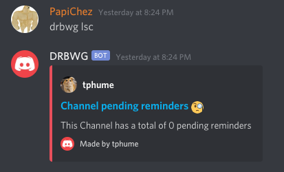

# DRBWG
`Discord Reminder Built With Go`
A discord bot built with the Go programming language. Allows user to set reminder in at a future date, the bot shall send a notification at the specified time to the channel. If you look through the code you will find some questionable design choices, which I have no idea why I did it that way. But since I am bored of this project - it is what it is.

## Getting started
The easiest way to get start the database, notification process and the bot is to use docker-compose. Simply run `docker-compose up` to build and start running the system.

## Commands
The bot watches for messages prefixed with in the following format`drbwg [command] [...args]`. Below list all the valid commands.

### `help`
List out all the commands along with its description. To get further information, pass the name of a specific command as an argument.

### `at`
Set a reminder given a timestamp as argument. The argument must be in the following format, `Jan-2-15:04-MST-2006`. Followed by a name for the reminder.

### `in`
Set a reminder given some duration as an argument. The command expects the following duration format `1h20m` which denotes, 1 hour and 20 minutes from the current time. Followed by a name for the reminder.

###  `lsg`
List out all the pending reminders for the guild in which the message is sent from.

### `lsc`
List out all the pending reminders for the channel in which the message is sent from.

### `update`
Update a reminder given its unique id with a new time. The user can either supply a duration format or a timestamp as the new time.

### `del`
Deletes a reminder given its unique id.

